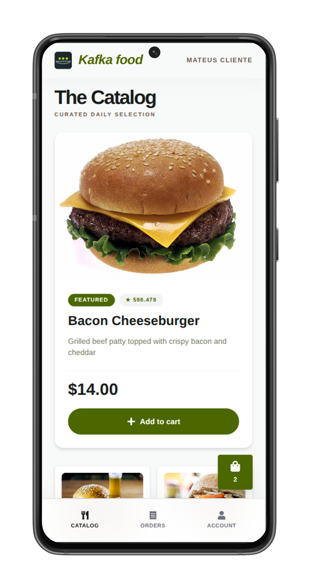
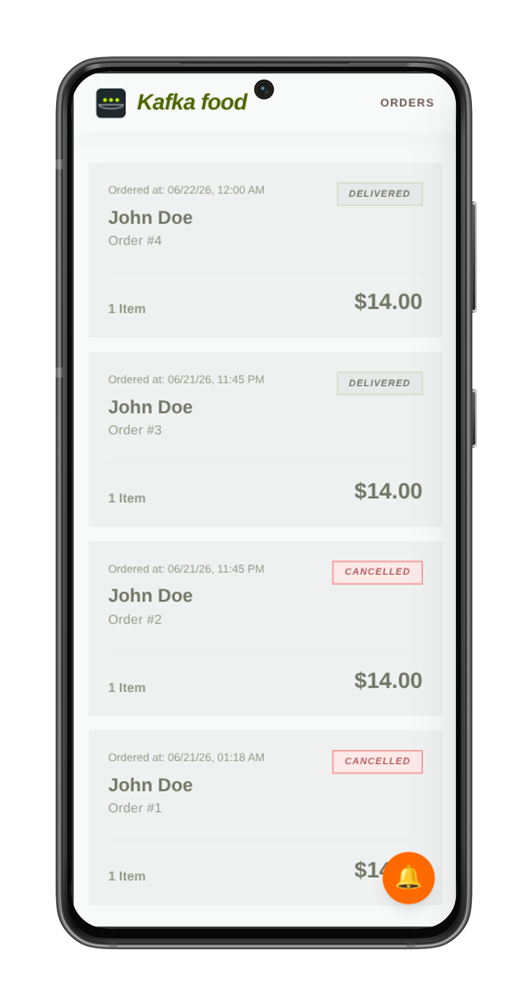

<h1>
   Hungry Kafka UI
</h1>

<p align="center">
   <br/>
  <a href="https://github.com/mateus-sartorio/hungry-kafka-ui"><kbd>🟢 Frontend</kbd></a>
  <a href="https://github.com/mateus-sartorio/hungry-kafka"><kbd>🔵 Backend</kbd></a>
</p>

> The web front-end for **Hungry Kafka** — a real-time, event-driven food-delivery platform.

Hungry Kafka UI is a **Next.js** application that serves two distinct experiences from a single codebase: a **customer app** for browsing a personalized catalog, ordering and tracking deliveries live, and a **store app** with a live order feed and a real-time situations dashboard. Every interaction flows to the backend, and every status change and situation of interest streams back over a **WebSocket** — the interface updates the instant something happens, without polling.

Developed for the **"Sistemas Orientados a Eventos" (Event-Driven Systems)** course at **UFES**. The event-driven backend (Spring Boot · Kafka · Kafka Streams) lives in a separate project, [`hungry-kafka`](https://github.com/mateus-sartorio/hungry-kafka).

---

## 📱 The apps

<table align="center">
  <tr>
    <th>🧑 Customer app</th>
    <th>🏪 Store app</th>
  </tr>
  <tr>
    <td></td>
    <td></td>
  </tr>
</table>

---

## ✨ What it does

### 🧑 Customer app

- **Browse a food catalog** — ranked per customer by inferred preference, so the food you engage with most floats to the top.
- **View product details** — full description, price and a featured highlight.
- **Manage a cart** — add and remove items from a slide-out cart drawer, with a live item count.
- **Place orders** and review order history at a glance (total, item count, status).
- **Track orders live** — every status change (accepted → preparing → out for delivery → delivered) streams in over the WebSocket in real time, including the expected delivery time.
- **Account settings** — manage the current customer identity.

### 🏪 Store app

- **Live order feed** — new orders pop into the list the instant a customer places them, no refresh needed.
- **Advance each order** through its lifecycle; the customer sees the change immediately on their side.
- **Real-time situations dashboard** — fed live by the backend's stream-processing engine, surfacing:
  - 🔥 **Hot Item** — a product getting an unusual burst of attention right now.
  - 🎯 **Hot Lead** — a customer showing high intent to buy a product.
  - 🛒 **Abandoned Cart** — a customer who filled a cart but did not check out in time.

---

## 🧰 Tech stack

| Technology | Role |
| --- | --- |
| **Next.js 16** (App Router) | React framework, routing and dev/build tooling |
| **React 19** | UI components |
| **TypeScript** | Type-safe application code |
| **Tailwind CSS 4** | Styling |
| **@stomp/stompjs** | STOMP over WebSocket — live order and situation updates |

---

## 🚀 Running the project

### Prerequisites

- **Node.js 20+**
- A running instance of the **Hungry Kafka backend** — see [**Running the backend**](#-running-the-backend) below.

### 1. Install dependencies

```bash
npm install
```

### 2. Run the front-end

The customer app and the store app run as two separate dev servers, each with an isolated Next.js build directory (`.next-client` and `.next-store`), so you can run **both at the same time** in separate terminals:

```bash
# Terminal 1 — customer app
npm run dev:client

# Terminal 2 — store app
npm run dev:store
```

Each server opens on [http://localhost:3000](http://localhost:3000); if the port is busy, Next.js automatically falls back to the next available port (e.g. `:3001`).

> [!TIP]
> The easiest way to manage Node.js versions is with [**nvm**](https://github.com/nvm-sh/nvm).
>
> To install nvm:
> `curl -o- https://raw.githubusercontent.com/nvm-sh/nvm/v0.40.1/install.sh | bash`
>
> Then open a new terminal and install/activate Node.js 20:
> `nvm install 20`
> `nvm use 20`
>
> To set it as the default version:
> `nvm alias default 20`

---

## ⚙️ Configuration reference

Each app reads its environment from a dedicated file — [`.env-client`](.env-client) and [`.env-store`](.env-store):

| Key | Default | Meaning |
| --- | --- | --- |
| `NEXT_PUBLIC_HOME_PAGE_MODE` | `client` / `store` | Which app the `/` route opens |
| `NEXT_PUBLIC_WS_URL` | `ws://localhost:8080/ws` | Backend STOMP WebSocket endpoint |

The REST API base (`http://localhost:8080`) points at the backend running locally.

---

## 🔗 Running the backend

This UI needs the **Hungry Kafka** backend running on `http://localhost:8080` (REST + WebSocket). See the backend README for prerequisites and full setup instructions → [**github.com/mateus-sartorio/hungry-kafka**](https://github.com/mateus-sartorio/hungry-kafka#-running-the-project)
